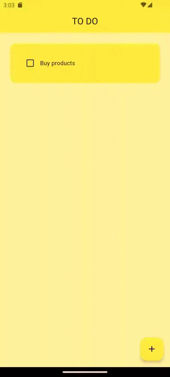

# To Do app

_Read this in other language: [English](README.md), [Русский](README.ru.md)_

## Project Description

This mini-application was created according to [tutorial](https://www.youtube.com/watch?v=HQ_ytw58tC4&t=4228s ) to upgrade skills on Flutter.
The To Do app has been implemented, where you can add/remove some reminders, mark them as completed and cancel this action.

## Feature List

- Saving data after closing the application.
- The ability to add/remove tasks.

## Demo

## Project Installation

1. [Installing Flutter](https://docs.flutter.dev/get-started/install)

2. Cloning a repository
   `git clone https://github.com/karishka1222/To-Do-App-Pet-project-on-Flutter.git`

3. Adding dependencies to a project

- `flutter pub get`
- `flutter pub add hive`
- `flutter pub add hive_flutter`
- `flutter pub add hive_generator`
- `flutter pub add build_runner`

## Frameworks and technologies used

* Description: Flutter is an open source framework by Google for building beautiful, natively compiled, multi-platform applications from a single codebase.
* Resources:
  * Official Website: [Official Website](https://flutter.dev/)
  * Documentation: [Documentation](https://docs.flutter.dev/)